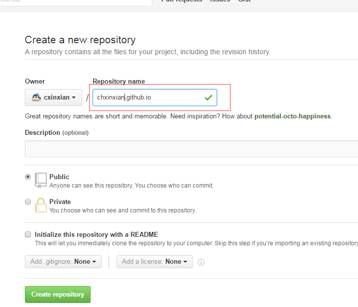

从网上搜到大神的博客，看到觉得很好看，非常简洁，于是乎千方百计的想弄一个我的个人博客，在此感谢大神门的热心分享。在我个人看来，只要引起我的兴趣的东西我都会去尝试一下，还好花的时间也不算很多，现在想想感觉弄这样的一个博客也不是很难，只要多花点心思就好了。


### 关于Hexo的介绍
Hexo是使用node.js技术开发的一个快速、简洁且高效的博客框架纯静态博客系统,
使用Markdown来编写文章，通过Hexo生成静态网页，然后部署到服务器上。

### 环境准备
##### 安装 [node.js](https://nodejs.org/en/)
作用：用来生成静态页面的
##### 安装 [Git](http://git-scm.com/download)
作用：是是把本地的Hexo提交到github或者Coding上去

### 安装Hexo
在安装完以上两个软件后，再你喜爱的文件夹内(如：E:\hexo)右键选择Git Bash here然后输入以下指令
`
$ npm install hexo -g
`
接着便是执行初始化指令，Hexo 即会自动在目标文件夹建立网站所需要的所有文件
`
$ hexo init
`
安装依赖包:
`
$ npm install
`
当初始化工作完成后，便可执行下面的指令了, `hexo g` 先是把Markdown文件生成静态网页，此时你会看到当前目录下会多出一个public文件夹;
而 `hexo s` 则是启动本地服务器，进行文章预览调试
``` bash
$ hexo g
$ hexo s
```
此时在浏览器输入：http://localhost:4000 就可以在本地预览你的个人博客了

### 提交把博客到Github和Coding 平台
（注：前提条件是在这两个平台都有账号，如果没有可以自行注册）
##### Github 创建Repository
建立与你用户名对应的仓库，仓库名必须为【your_user_name.github.io】，固定写法,如下图所示


##### Coding 创建Repository


